<h1 align="center">Amgi</h1>

<p align="center">
  <em>암기 (amgi) - 韩语中意为“记忆 / 背诵”</em>
</p>

<p align="center">
  一个开源、离线优先、兼容 Anki 的 iOS 闪卡客户端，支持同步服务器。
</p>

<p align="center">
  
  
  
  
</p>

<p align="center">
  <a href="./README.md">English</a> | 简体中文
</p>

---

Amgi 通过 C FFI 封装官方 [ankitects/anki](https://github.com/ankitects/anki) Rust 后端，为 iOS 带来原生 SwiftUI 体验，同时沿用驱动 Anki Desktop 与 AnkiDroid 的成熟核心能力。你可以连接任意兼容的同步服务器（包括自托管服务）同步牌组，使用 FSRS 调度复习，并让复习记录在各设备之间保持一致。

## 功能特性

- **兼容 Anki 的核心能力** - 通过 C FFI 使用官方 Anki Rust 后端处理调度、数据库访问、导入导出、卡片生成与集合维护，而不是在 Swift 中自行重写一套行为。
- **离线优先学习** - 即使没有网络，依然可以本地完成复习、编辑、浏览、阅读和维护等主要流程。
- **灵活同步** - 支持登录 AnkiWeb，或连接兼容的自托管同步服务器；内置普通同步、全量上传/下载、媒体同步、进度显示与冲突处理流程。
- **真正的 FSRS，而非复刻版** - 基于 Anki 官方 FSRS 引擎，支持牌组级 FSRS 开关、目标保留率调整、预设管理、工作量模拟和参数优化。
- **接近桌面端的卡片渲染** - 卡片由 Anki 模板引擎负责渲染，支持媒体内容，尽可能贴近桌面端在模板、样式和复习展示上的行为。
- **牌组管理** - 支持层级牌组浏览、查看 new/learn/review 数量、创建与重命名牌组或子牌组、导出牌组包，并管理牌组预设和调度选项。
- **专注的复习体验** - 支持 Again/Hard/Good/Easy、间隔预览、音频回放、typed answer、旗标、埋藏/暂停、撤销、修改到期日，以及复习中的笔记/卡片编辑工具。
- **强大的浏览与批量操作** - 支持全库搜索、按牌组和标签过滤、排序、懒加载结果、多选，并执行批量标签编辑、删除、移动牌组、修改笔记类型、导出、暂停和重置为新卡等操作。
- **富文本笔记编辑** - 支持基于后端真实字段名创建和编辑笔记，提供富文本字段编辑、标签管理、媒体插入、录音、源码模式和提交前卡片预览。
- **图像遮挡支持** - 支持原生创建和编辑 Image Occlusion 笔记，内置矩形、椭圆、多边形与文本遮罩工具。
- **模板与笔记类型工具** - 可在应用内直接查看和编辑卡片模板、CSS 与字段定义，并提供模板管理和字段管理界面。
- **完整统计面板** - 支持查看今日统计、复习热力图、未来到期预测、卡片数量、稳定度/难度图、小时分布、按钮分布、retrievability 与 retention，并支持按牌组筛选及图表顺序自定义。
- **内置阅读器** - 支持阅读来自 Anki 笔记或导入 EPUB 的长文本内容，记录阅读进度、管理书架，并将阅读流程与学习流程打通。
- **字典驱动的查词体验** - 在阅读器和复习页中都支持类 Yomitan 查词，并提供词典导入、推荐下载、更新、启用/禁用及本地音频选项。
- **导入、导出与备份** - 支持集合包与牌组包导入导出、所选笔记导出、备份创建、文件管理、数据库检查、媒体检查和空卡维护工具。
- **多用户与应用设置** - 支持本地多用户资料切换，并可自定义主题、语言、复习行为、编辑器选项、阅读器偏好和首页/统计页展示方式。
- **Swift 6.2 严格并发** - 基于 actor isolation 与全面 `Sendable` 化的依赖设计，保证 Swift 侧实现现代、清晰且更安全。

## 截图

<p align="center">
    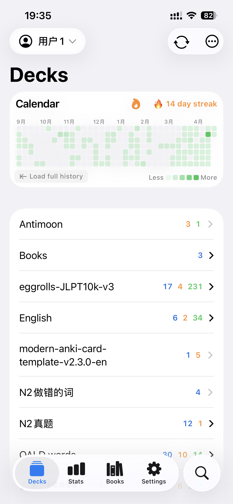
    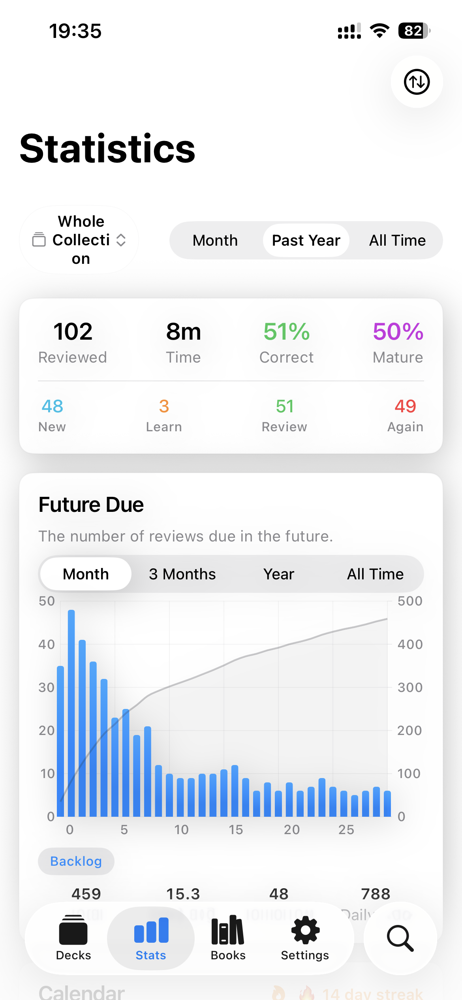
    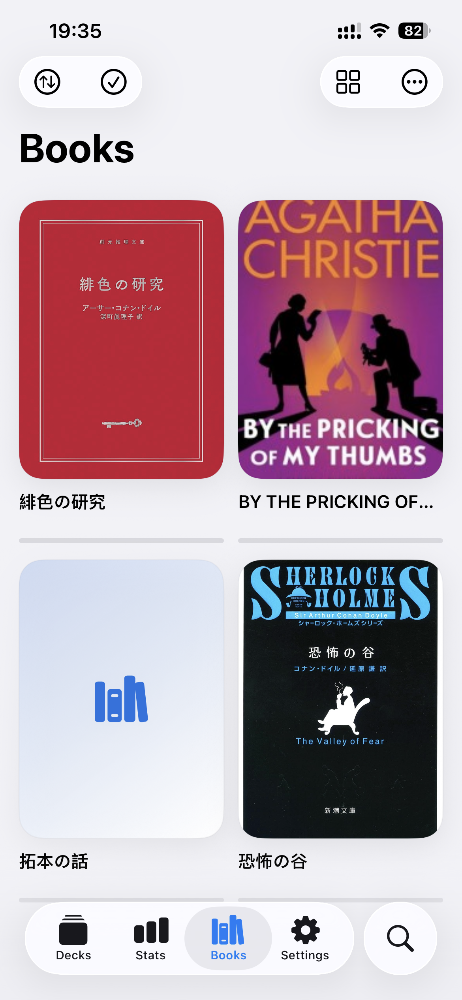
    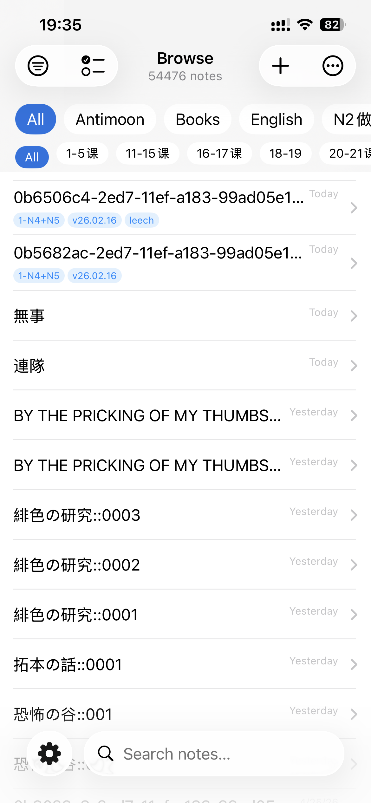
    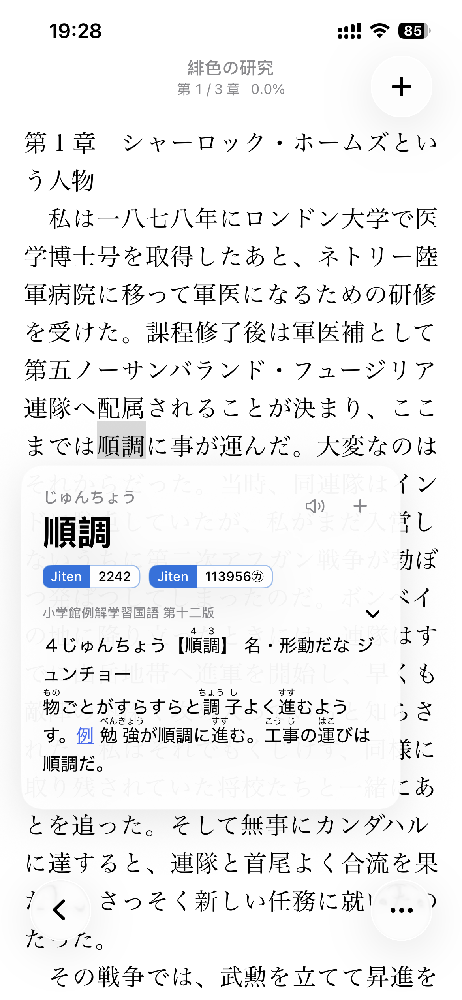
    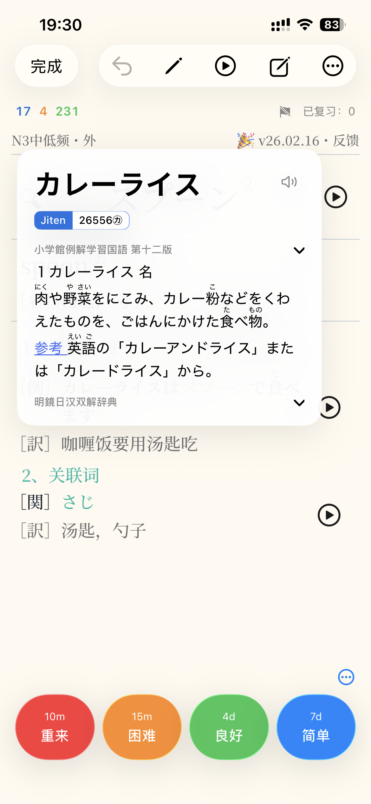
    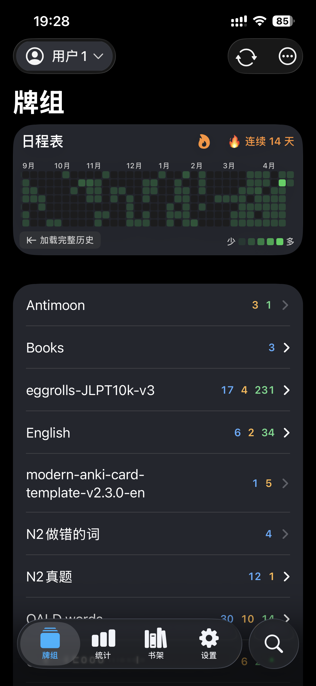
    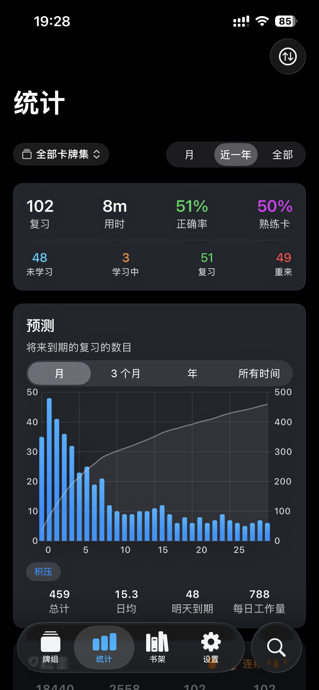
    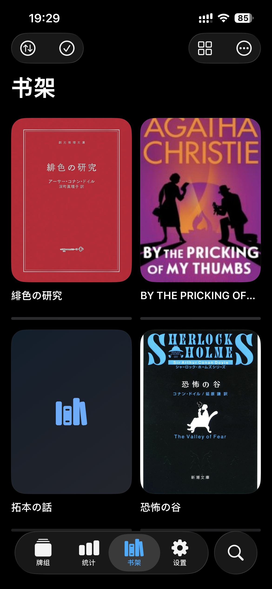
    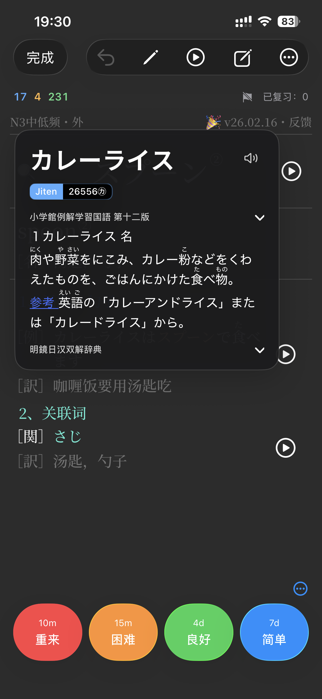
    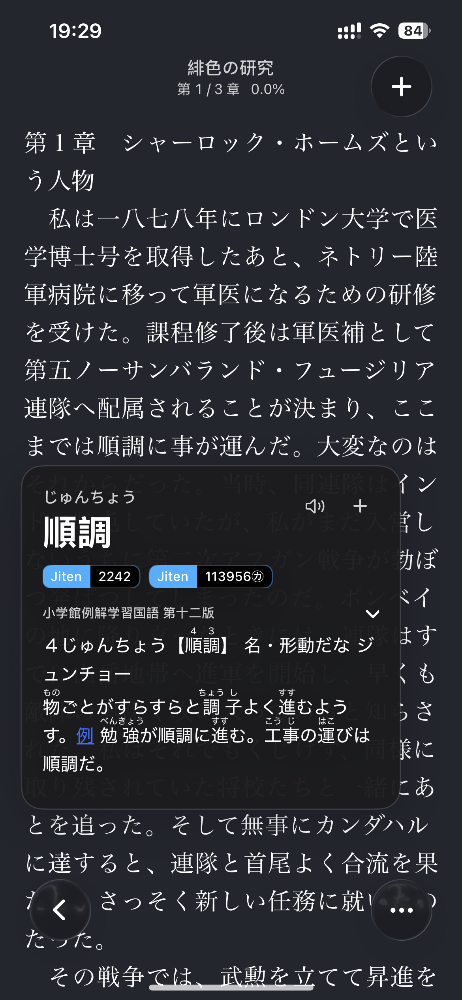
    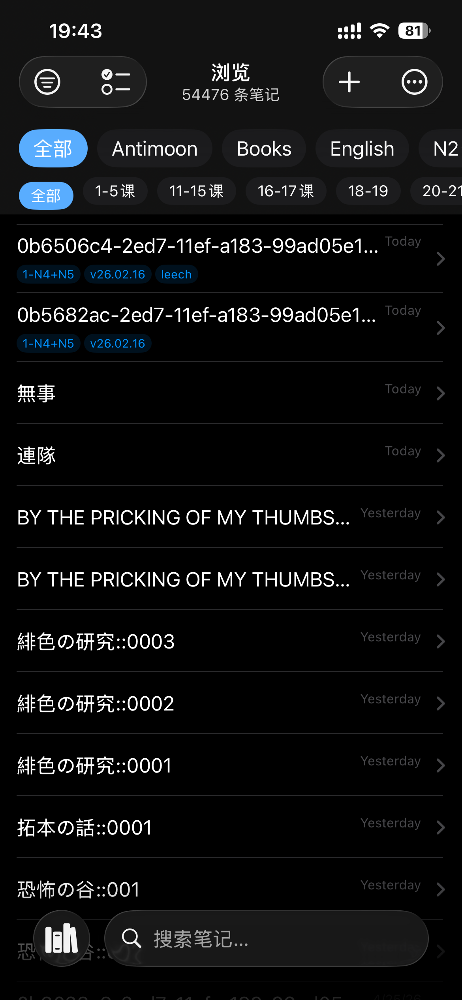
</p>

## 架构

```
SwiftUI Views
    |
@DependencyClient structs
    |
AnkiBackend (Swift wrapper)
    |
C FFI (4 functions)
    |
Rust static library (ankitects/anki)
```

Swift 负责 UI；Rust 负责其余核心能力，包括数据库、同步、FSRS 调度、卡片模板与统计等。

完整架构说明见 **[ARCHITECTURE.md](ARCHITECTURE.md)**。

## 环境要求

| 工具 | 版本 |
|------|---------|
| iOS | 17.0+ |
| Xcode | 16.0+ |
| Rust | 1.92+（通过 rustup） |
| protoc | 3.0+ |
| protoc-gen-swift | latest |
| xcodegen | latest |

## 快速开始

### 1. 以子模块方式克隆仓库

```bash
git clone --recursive https://github.com/antigluten/anki-ios.git
cd anki-ios
```

### 2. 安装依赖

```bash
# Rust toolchain
curl --proto '=https' --tlsv1.2 -sSf https://sh.rustup.rs | sh
rustup target add aarch64-apple-ios aarch64-apple-ios-sim x86_64-apple-ios-simulator

# Protobuf compiler and Swift plugin
brew install protobuf swift-protobuf

# Xcode project generator
brew install xcodegen
```

### 3. 构建 Rust XCFramework

```bash
./scripts/build-xcframework.sh
```

该脚本会为 iOS 真机与模拟器交叉编译 Rust bridge，并将其打包为 `AnkiRust.xcframework`。首次构建可能需要数分钟，后续增量构建会更快。

### 4. 生成 Swift Protobuf 类型

```bash
./scripts/generate-protos.sh
```

### 5. 用 Xcode 打开工程

```bash
cd AnkiApp && xcodegen generate && cd ..
open AnkiApp/AnkiApp.xcodeproj
```

### 6. 构建并运行

选择一个 iOS 模拟器或真机后，在 Xcode 中构建并运行（Cmd+R）。

## 技术栈

- **UI**: SwiftUI + 严格并发（Swift 6.2，language mode v6）
- **依赖注入**: [swift-dependencies](https://github.com/pointfreeco/swift-dependencies)（`@DependencyClient` struct-closure 模式）
- **后端**: [ankitects/anki](https://github.com/ankitects/anki) Rust crate，通过 C FFI 接入
- **序列化**: Protocol Buffers（24 个 `.proto` 服务定义）
- **数据库**: SQLite（由 Rust 后端持有）
- **构建**: 库模块使用 SPM，App target 使用 xcodegen

## 许可证

本项目采用 **GNU Affero General Public License v3.0 (AGPL-3.0)**，因为其集成了同样使用 AGPL-3.0 的 [ankitects/anki](https://github.com/ankitects/anki)（版权所有归 Ankitects Pty Ltd 所有）。完整许可证见 [LICENSE](LICENSE)。

AGPL 要求：如果你分发本软件，或将其作为网络服务运行，你必须以相同许可证公开完整源代码。

## 参与贡献

欢迎贡献。请查看 [CONTRIBUTING.md](CONTRIBUTING.md) 了解贡献规范、代码风格与开发环境说明。

## 致谢

- 感谢 **[Damien Elmes](https://github.com/dae)** 与 [ankitects/anki](https://github.com/ankitects/anki) 贡献者们提供驱动本应用的 Rust 后端
- 感谢 **[AnkiDroid](https://github.com/ankidroid/Anki-Android)** 在移动端率先实践 Rust 后端桥接方案
- 感谢 **[Point-Free](https://www.pointfree.co/)** 提供 [swift-dependencies](https://github.com/pointfreeco/swift-dependencies)
